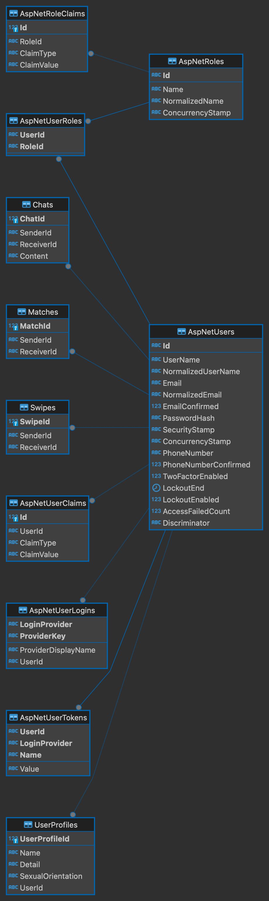

# Tender

Tender is the backend server for a dating application designed to connect individuals in a modern, efficient, and secure manner.

## URL

https://tenderwad.azurewebsites.net

## Features

- **User Registration**: Users can sign up by providing their email and password.
- **Email Verification**: After registration, an email is sent to the user's address to verify its authenticity.
- **Login**: Post-verification, users can log in to the application and receive a JWT (JSON Web Token) for authentication purposes.
- **Profile Creation**: Users can create and update their profiles, adding their name, details, and sexual orientation.
- **Sending Likes**: Users have the ability to send likes to other users, indicating their interest.
- **Receiving Likes**: Users who receive likes can respond by accepting or rejecting them.
- **Matches**: If two users mutually accept likes, a match is created, allowing them to connect further.
- **Messaging**: Matched users can communicate with each other through messages, fostering a connection.
- **Dependency Injection Utilization**: Utilization of Dependency Injection for decoupling dependencies and promoting testability and maintainability.
- **Application Logging**: Implementation of logging for tracking application events, including logging levels, log message formatting, and log storage configuration.

## Getting Started

To get started with Tender, follow these steps:

1. Clone the repository to your local machine.
2. Ensure you have the necessary environment set up, including any required databases or services.
3. Install the dependencies.
4. Set up your environment variables, including those needed for email services and JWT authentication.
5. Run the application.

## Technology

- APP: ASP.NET Core 7.0
- DB: SQL Server
- User Management: Identity Framework
- Cloud Platform: Microsoft Azure
- Version Control: Git/GitHub/GitHub Action
- Email Server: Gmail

## ERD

